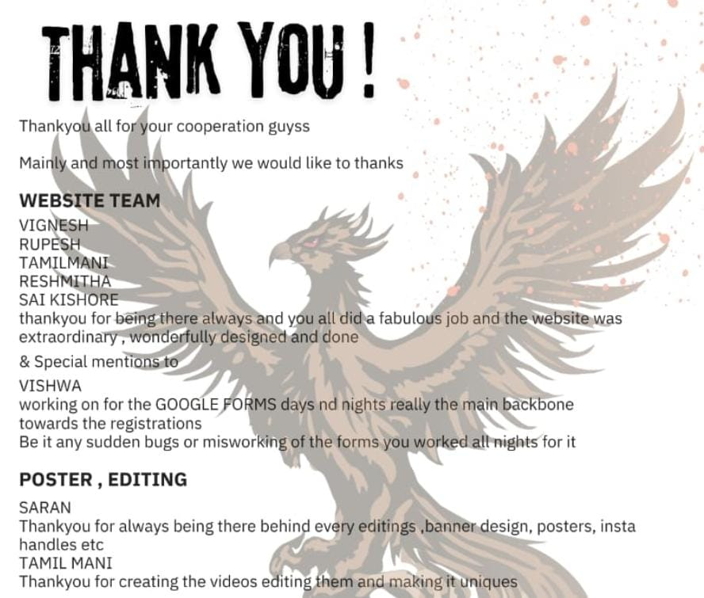

# Pranav2k24

<!-- OBJECTIVE -->
## Objective
Created the official website accessed By 30,000 People Worldwide (Pranav 2k24)

<!-- TABLE OF CONTENTS -->

  
Table of Contents

  <ol>
    <li><a href="#about-the-project">About The Project</a> </li>
    <li><a href="#built-with">Built With</a></li>
    <li><a href="#getting-started">Getting Started</a> </li>
    <li><a href="#usage">Usage</a></li>
    <li><a href="#roadmap">Roadmap</a></li>
    <li><a href="#contributing">Contributing</a></li>
    <li><a href="#license">License</a></li>
    <li><a href="#contact">Contact</a></li>
  </ol>

<!-- ABOUT THE PROJECT -->
## About The Project

Project Overview 😲

A website for a college symposium serves as a central hub for information, communication, and engagement for all stakeholders—organizers, participants, speakers, and sponsors.
It streamlines the registration process, provides event details, and facilitates interaction between attendees. Key features often include:

* Event Information: Display key event details, including dates, venue, schedule, and agenda.
* Online Registration: Simplify the registration process for participants, speakers, and attendees.
* Agenda and Speaker Profiles: Provide a detailed event schedule with speaker bios, session descriptions, and timings.
* Interactive Features: Allow for abstract submissions, live updates, networking opportunities, and feedback collection.
* Sponsor and Partner Acknowledgment: Highlight sponsors and partners with logos, descriptions, and links to their websites.
* A well-designed symposium website enhances attendee experience, ensures seamless communication, and elevates the overall success of the event.

Use the `BLANK_README.md` to get started.

(<a href="#readme-top">back to top</a>)

### Built With

This section is the list of major frameworks/libraries used to bootstrap our project. Leave any add-ons/plugins for the acknowledgements section. Here are a few examples.

* HTML
* CSS
* JAVA SCRIPT
* SQL
* CLOUD MANAGEMENT SYSTEM
* MICROSOFT OFFICE
* PAYMENT
* FIGMA
* CANVA
* ADOBE

(<a href="#readme-top">back to top</a>)

<!-- GETTING STARTED -->
## Getting Started

This is an example of how you may give instructions on setting up your project locally.
To get a local copy up and running follow these simple example steps.

<!-- USAGE EXAMPLES -->
## Usage

* Event Registration: Allow participants to register for the symposium, workshops, or competitions online.
* Event Schedule: Display the event schedule, including session timings, speaker details, and workshops.
* Speaker/Guest Profiles: Provide information about keynote speakers, panelists, and guests.
* Abstract/Research Submissions: Enable participants to submit abstracts, papers, or project proposals.
* Event Updates: Share the latest announcements, schedule changes, and other important information.
* Sponsor Information: Showcase sponsors and partners, including their logos, descriptions, and links.
* Interactive Maps: Provide a venue map, including session locations and areas like registration, food, etc.
* Networking Opportunities: Allow attendees to connect, share profiles, or join discussion boards.
* Multimedia Gallery: Post photos, videos, and other media from the event or promotional materials.
* Feedback Collection: Collect feedback from attendees, speakers, and participants to improve future events.

_For more examples, please refer to the [Documentation](#)

(<a href="#readme-top">back to top</a>)

## Roadmap

- [x] Define project scope and requirements
- [x] Create wireframes and UI/UX design
- [x] Choose tech stack (front-end & back-end)
- [x] Set up version control (Git)
- [x] Develop front-end (HTML, CSS, JS)
- [x] Develop back-end (server, database, APIs)
- [x] Perform testing (functional, performance, cross-browser)
- [x] Implement SEO best practices
- [x] Deploy website (hosting, domain setup)
- [x] Monitor, maintain, and update regularly

See the [open issues](https://github.com/RESH-22/Pranav2k24.git) for a full list of proposed features (and known issues).

(<a href="#readme-top">back to top</a>)

<!-- CONTRIBUTING -->
## Contributing

In website development, success is never the result of one individual’s efforts alone—it’s the result of collaboration. 
Our team thrives on a shared vision, where each member brings unique skills to the table. 
From front-end design to back-end architecture, testing, and deployment, we work together to ensure the highest quality and functionality.

Each team member’s contributions—whether it’s designing an intuitive user interface, optimizing performance, or implementing security measures—are integral to delivering a seamless user experience. 
Effective communication, problem-solving, and mutual respect are the pillars of our teamwork, ensuring that the project moves forward with unity and purpose.

Our combined effort is what drives the success of this website, and **we are proud of what we’ve built together**.

Don't forget to give the project a star! Thanks again!

### Top Contributors:

(<a href="#readme-top">back to top</a>)

<!-- LICENSE -->
## License

Distributed under the MSEC License. See `LICENSE.txt` for more information.

(<a href="#readme-top">back to top</a>)

<!-- CONTACT -->
## Contact

Team members (Web Development)
* Rupesh S
* Vishwanathan K
* Vigneshwar B
* Sai Kishore 
* Reshmitha R - rreshmitha22@gmail.com
  
Team members (Editors)
* Saran Dev C
* Tamilmani

Project Link: [https://github.com/RESH-22/Pranav2k24.git](https://github.com/RESH-22/Pranav2k24.git)
Website Link:[https://pranav2k24.netlify.app/](Pranav2k24)

(<a href="#readme-top">back to top</a>)

